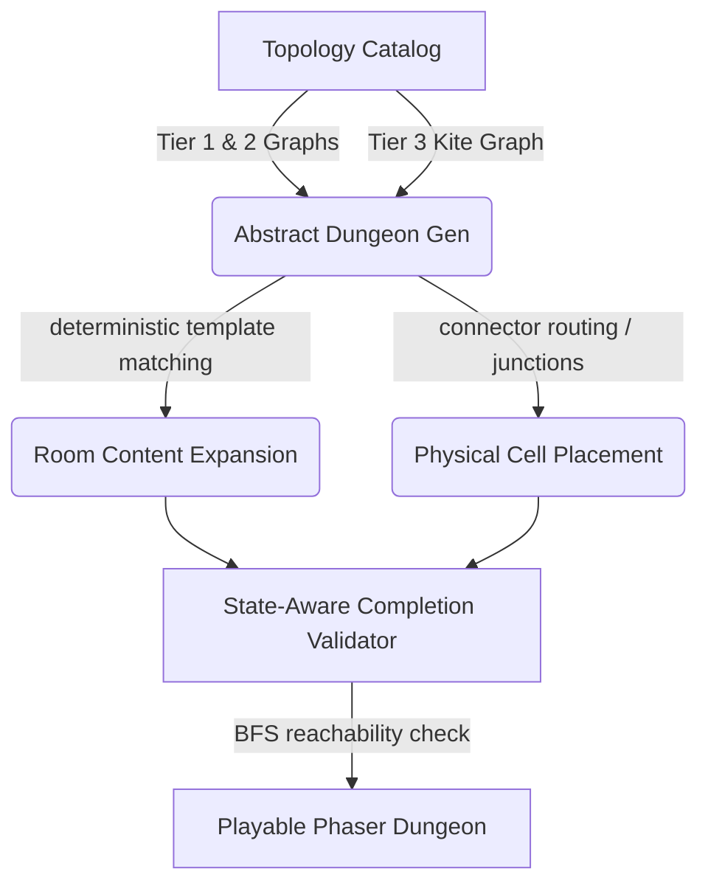

# Code Review: Recent Commit Analysis

This document provides a detailed review of the work completed in the two most recent commits (**311b294** and **11b8d43**), followed by analysis of potential edge cases, logic improvements, and future refactoring suggestions.

---

## 🛠️ Work Completed

The last two commits implement key milestones for **nonlinear procedural dungeon generation**, introducing directional traversal constraints, room content/NPC variance, loops, and dense geometries.



### 1. Movement, Noise & Traversal Enforcement
- **`enforceConnectorTraversal`**: Tracks previous valid room positions using a `WeakMap`. Teleports actors (players, followers, and monsters) back to their last room if they illegally traverse locked/secret boundaries or attempt to move uphill on one-way paths (slides/controlled drops).
- **Acoustic Alert Propagation**: Added a noise system. Actions like melee swings, breaking weak walls, and heaving portcullises trigger `emitNoiseAt()`, alerting patrol-state monsters up to 1 open connector hop away.
- **Monster AI State Retention**: Added `alertedUntil` to `MonsterSprite` to keep monsters in `aggro` mode for a set duration (`6000ms`) after hearing noise, even if the party is out of visual range.

### 2. Room Variance & Talkable NPCs
- **Deterministic Room Templates**: Introduced 12 family-categorized room templates across 6 content families (`discovery`, `challenge`, `hazard`, `opportunity`, `pressure`, `twist`) with associated resource pressures (light, HP, time, position, inventory).
- **Social NPC Encounters**: Added interactive NPCs with 7 distinct outcomes:
  - *Basic*: Torches (`give-torch`), concealed paths (`reveal-route`), and advice (`warning`).
  - *Advanced*: Trades (`trade`), remote mechanisms (`revelation`), companion eligibility (`companion-eligible`), and combat ambushes (`betrayal`).
- **Companion Integration**: Integrated the companion-eligible NPC resolution with the sanctuary vault reward. resolved eligible NPCs now join the party with their custom class (Thief/Priest/Wizard) and name.

### 3. Advanced Topologies & Grid Embedding
- **Expanded Topologies**: Shipped 9 Tier 2 loop/hub topologies and the Tier 3 `kite` junction topology.
- **Junction Routing**: Enabled multi-edge path routing through a single shared filler cell (`viaJunction` flag) to support dense structures.
- **Redundant Connection Capping**: For dense Tier 3 topologies, automatically trims redundant open edges by converting them to secret doors, capping each room's initially open connection degree to at most 3.

### 4. Verification & Save Systems
- **State-Aware BFS Validator**: Implemented a physical reachability solver in `physical.ts` that simulates walkthrough progression using a key/switch acquisition bitmask to ensure no layout is self-locking or dead-ended.
- **Exploration UI**: Added a 4x5 character-based compact expedition map (`compactMap`) to the HUD.
- **Save Integrity**: Added `discoveredRoomIds` and `npcInteractionStates` to `SaveSlot` and verified save file schema validation.

---

## 🔍 Areas for Improvement

### 1. Greedy Edge-Trimming Disconnection Risk (Critical)
In `generate.ts`, the redundant edge trimming logic for Tier 3 topologies converts open connections to secret doors to cap room degrees at 3:
```typescript
for (const connection of [...connections].reverse()) {
  if (!optionalIds.has(connection.id) || !initiallyOpen(connection)) continue;
  if ((openDegree.get(connection.fromRoomId) ?? 0) <= 3 && (openDegree.get(connection.toRoomId) ?? 0) <= 3) continue;
  connection.state = "secret";
  // ...
  openDegree.set(connection.fromRoomId, (openDegree.get(connection.fromRoomId) ?? 1) - 1);
  openDegree.set(connection.toRoomId, (openDegree.get(connection.toRoomId) ?? 1) - 1);
}
```
> [!WARNING]
> **The Graph Disconnection Bug:**
> The `optionalIds` set is computed statically using `redundantEdges(form)`. While removing *any single* redundant edge maintains connectivity, removing *multiple* edges from that set simultaneously can disconnect nodes.
> E.g., in a complete graph $K_5$, this logic will sequentially trim edges touching a node until its open degree drops to $0$, completely isolating that room from open path navigation.
> 
> **Recommendation:** Update `openDegree` and re-evaluate path connectivity dynamically after each trim, or re-run a fast union-find/DFS reachability check before committing to making a connector secret.

### 2. Inconsistent HUD Map Visibility
In `Hud.ts`, the compact expedition map is set to display only if the dungeon has at least 5 connectors:
```typescript
this.mapText
  .setVisible((this.dungeon.activeDungeon.connectors?.length ?? 0) >= 5)
```
> [!NOTE]
> Tier 1 branching topologies like `arrow`, `cross`, `moose`, and `v` have exactly 4 edges (connectors). Consequently, the map remains hidden for these layouts, but is shown for `fauchard-fork` (5 edges) and Tier 2/3 topologies.
> 
> **Recommendation:** Check if `connectors` is defined (which distinguishes it from authored legacy dungeons), or lower the limit to `connectors.length >= 4` so all procedural non-linear layouts display the navigation map.
> ```typescript
> this.mapText.setVisible(this.dungeon.activeDungeon.connectors !== undefined);
> ```

### 3. Silent NPC Interactions
When talkable NPCs trigger `reveal-route` or `revelation` outcomes, they call `openNpcTargetConnector()` which mutates connector state and destroys physical blockers in the scene, but does not provide auditory feedback to the player.
> [!TIP]
> **Recommendation:** Trigger `sfx.doorThump()` or a similar sound effect when an NPC remotely opens a path, matching the auditory feedback when a player manually heaves a portcullis.

### 4. Code Quality & Redundancy
- **Legacy Rescue Tiles**: The parser in `dungeons.ts` explicitly checks and throws an error if legacy rescue tiles (`2`, `3`, `4`) are present. However, the scene code in `Dungeon.ts` still contains parsing logic for these cases (`case "2":`, `case "3":`, `case "4":`). Since these are banned by the validator, this code is dead and can be safely cleaned up.
